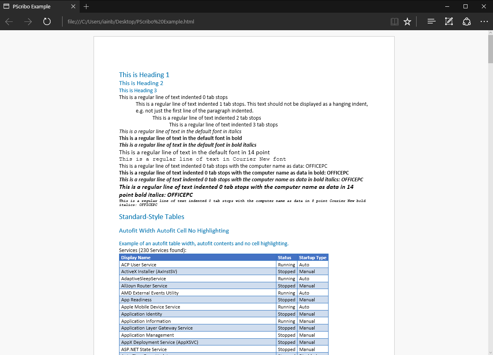
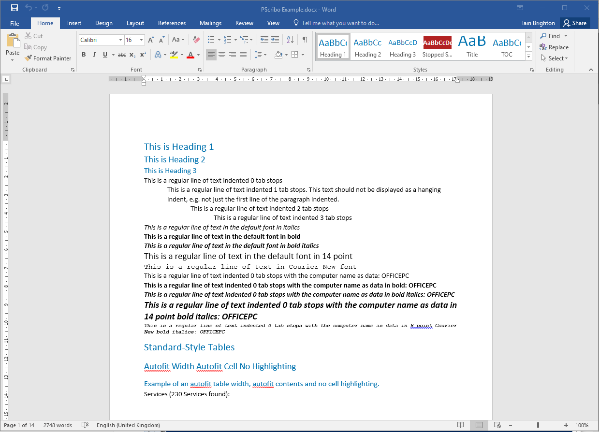
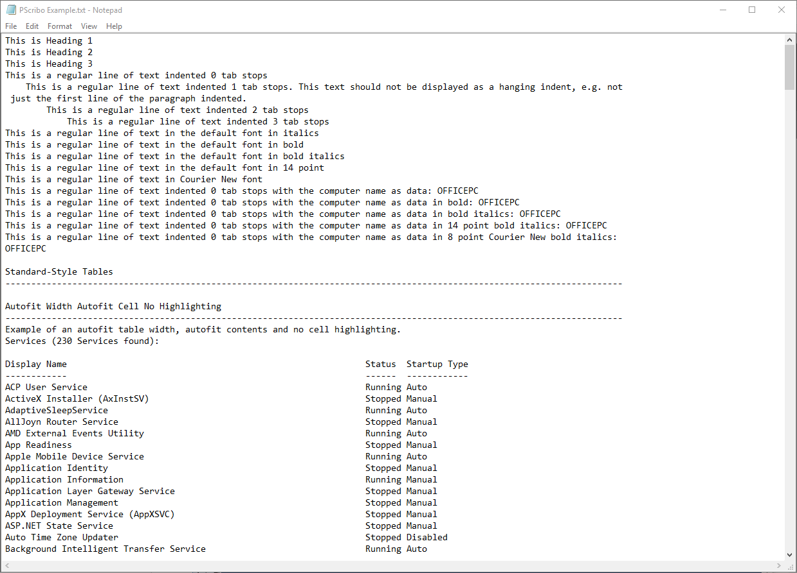

# PScribo (Preview) #

_PScribo_ (pronounced 'skree-bo') is an open source project that implements a
documentation domain-specific language (DSL) for Windows PowerShell, used to
create a "document" in a standardised format. The resulting "document" can be
exported into various formats by "plugins", for example, text, HTML, XML
and/or Microsoft Word format.

PScribo provides a set of functions that make it easy to create a document-like
structure within Powershell scripts, without having to be concerned with
handling output formatting or supporting multiple output formats.

## Authoring Example ##

```powershell
Import-Module PScribo

Document 'PScribo Example' {

    Paragraph -Style Heading1 'This is Heading 1'
    Paragraph -Style Heading2 'This is Heading 2'
    Paragraph -Style Heading3 'This is Heading 3'
    Paragraph 'This is a regular line of text indented 0 tab stops'
    Paragraph -Tabs 1 'This is a regular line of text indented 1 tab stops. This text should not be displayed as a hanging indent, e.g. not just the first line of the paragraph indented.'
    Paragraph -Tabs 2 'This is a regular line of text indented 2 tab stops'
    Paragraph -Tabs 3 'This is a regular line of text indented 3 tab stops'
    Paragraph 'This is a regular line of text in the default font in italics' -Italic
    Paragraph 'This is a regular line of text in the default font in bold' -Bold
    Paragraph 'This is a regular line of text in the default font in bold italics' -Bold -Italic
    Paragraph 'This is a regular line of text in the default font in 14 point' -Size 14
    Paragraph 'This is a regular line of text in Courier New font' -Font 'Courier New'
    Paragraph "This is a regular line of text indented 0 tab stops with the computer name as data: $env:COMPUTERNAME"
    Paragraph "This is a regular line of text indented 0 tab stops with the computer name as data in bold: $env:COMPUTERNAME" -Bold
    Paragraph "This is a regular line of text indented 0 tab stops with the computer name as data in bold italics: $env:COMPUTERNAME" -Bold -Italic
    Paragraph "This is a regular line of text indented 0 tab stops with the computer name as data in 14 point bold italics: $env:COMPUTERNAME" -Bold -Italic -Size 14
    Paragraph "This is a regular line of text indented 0 tab stops with the computer name as data in 8 point Courier New bold italics: $env:COMPUTERNAME" -Bold -Italic -Size 8 -Font 'Courier New'

    PageBreak

    $services = Get-CimInstance -ClassName Win32_Service | Select-Object -Property DisplayName, State, StartMode | Sort-Object -Property DisplayName

    Style -Name 'Stopped Service' -Color White -BackgroundColor Firebrick -Bold

    Section -Style Heading1 'Standard-Style Tables' {
        Section -Style Heading2 'Autofit Width Autofit Cell No Highlighting' {
            Paragraph -Style Heading3 'Example of an autofit table width, autofit contents and no cell highlighting.'
            Paragraph "Services ($($services.Count) Services found):"
            $services | Table -Columns DisplayName,State,StartMode -Headers 'Display Name','Status','Startup Type' -Width 0
        }
    }

    PageBreak

    Section -Style Heading2 'Full Width Autofit Cell Highlighting' {
        Paragraph -Style Heading3 'Example of a full width table with autofit columns and individual cell highlighting.'
        Paragraph "Services ($($services.Count) Services found):"
        <# Highlight individual cells with "StoppedService" style where state = stopped and startup = auto #>
        $stoppedAutoServicesCell = $services.Clone()
        $stoppedAutoServicesCell | Where { $_.State -eq 'Stopped' -and $_.StartMode -eq 'Auto'} | Set-Style -Property State -Style StoppedService
        $stoppedAutoServicesCell | Table -Columns DisplayName,State,StartMode -Headers 'Display Name','Status','Startup Type' -Tabs 1
    }

} | Export-Document -Path ~\Desktop -Format Word,Html,Text -Verbose
```

For more detailed infomation on the documentation DSL, see
[about_Document](https://raw.githubusercontent.com/iainbrighton/PScribo/dev/en-US/about_Document.help.txt).

Pscribo can export documentation in a variety of formats and currently
supports creation of text, xml, html and Microsoft Word formats. 

### Example Html Output ###


[Example Html Document Download](https://raw.githubusercontent.com/iainbrighton/PScribo/dev/PScriboExample.html)

### Example Word Output ###


[Example Word Document Download](https://raw.githubusercontent.com/iainbrighton/PScribo/dev/PScriboExample.docx)

### Example Text Output ###


[Example text Document Download](https://raw.githubusercontent.com/iainbrighton/PScribo/dev/PScriboExample.txt)

Additional "plugins" can be created to support future formats if required. For
more detailed information on creating a "plugin" see
[about_Plugins](https://raw.githubusercontent.com/iainbrighton/PScribo/dev/en-US/about_Plugins.help.txt).

The _PScribo_ __preview__ is currently available as a Powershell module in the
[PowerShell gallery](https://www.powershellgallery.com/items?q=pscribo) and
in future, will also be provided as a "bundle" to enable easy integration
into existing scripts. The bundle release permits dot-sourcing the PowerShell
functions or being placed in its entirety at the beginning of an existing
PowerShell .ps1 file.

Requires __Powershell 3.0__ or later.

If you find it useful, unearth any bugs or have any suggestions for improvements,
feel free to add an [issue](https://github.com/iainbrighton/PScribo/issues) or
place a comment at the project home page.

## Installation ##

* Automatic (via PowerShell Gallery:
  * Run 'Install-Module PScribo'.
  * Run 'Import-Module PScribo'.
* Manual:
  * Download and unblock the latest .zip file.
  * Extract the .zip into your $PSModulePath, e.g. ~\Documents\WindowsPowerShell\Modules\.
  * Ensure the extracted folder is named 'PScribo'. 
  * Run 'Import-Module PScribo'.

For an introduction to the PScribo framework, you can view the presentation given at the
[PowerShell Summit Europe 2015](https://www.youtube.com/watch?v=pNIC70bjBZE).

## Versions ##

### 0.7.20 ###

* Fixes unit tests for Pester v4.x compatibility
* Fixes [DateTime] discrepancy in Word and Html table output (#68)
* Fixes errors importing module on non-English locales (#63)
* Corrects PowerShell Core `IsMacOS` environment variable rename

### 0.7.19 ###

* Adds default styles for heading levels 4 - 6 (#59)
* Fixes $PSVersionTable.PSEdition strict mode detection errors on PS3 and PS4
* Fixes bug with nested HTML section output depth warning (#57)

### 0.7.18 ###

* Adds ClassId parameter to TOC for HTML output

### 0.7.17 ###

* Renames 'Hide' parameter to 'Hidden' on Style keyword
  * Adds 'Hide' alias for backwards compatibility
* Fixes errors importing localized data on en-US systems (#49)
  
### 0.7.16 ###

* Supports hiding styles, e.g. in MS Word (#32)
* Fixes Html and Word decimal localisation issues (#6, #42)
* Adds support for CRLFs in paragraphs and table cells (#46)

### 0.7.15 ###

* Adds Core PowerShell (v6.0.0) support
* Fixes tests in Pester v4
* Adds `Merge-PScriboPluginOptions` method to merge document, plugin and runtime options (#24)
* Adds `-PassThru` option to `Export-Document` (#25)
* Renames `GlobalOption` to `DocumentOption` (#18)
  * Adds `GlobalOption` alias for backwards compatibility
